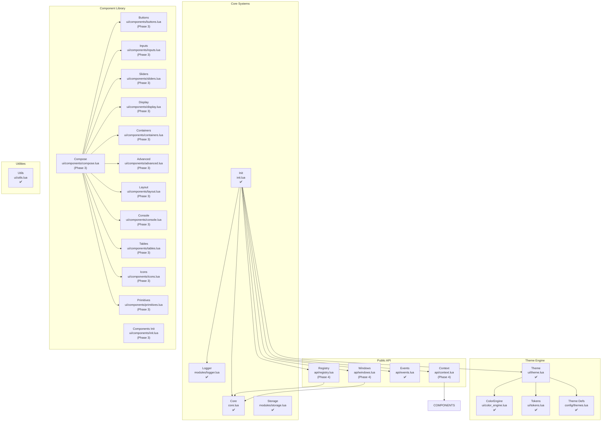
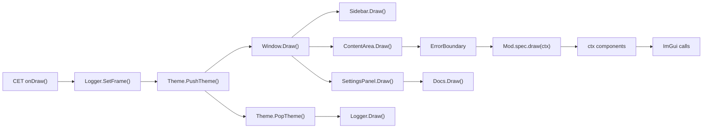

# Architecture — UI-Engine

## Overview

UI-Engine is a **framework/library** for CET mod configuration UIs. It provides a component library, theme system, and mod registration infrastructure. **UI-Engine does not have its own UI** — that's Config-Engine's job.

Consumer mods (like Config-Engine) register with UI-Engine and receive a `ctx` (context) object that provides access to all UI components. UI-Engine provides the toolbox; Config-Engine builds the house.

### Key Separation

| Module | Role | Owner |
|--------|------|-------|
| Log-Engine | Standalone file-based logging for all mods | This workspace |
| UI-Engine | Framework/library (components, themes, core, events) | This workspace |
| Config-Engine | Consumer mod (window, sidebar, settings UI) | This workspace |
| Consumer Mods | Other mods using UI-Engine/Log-Engine API | External |

### UI-Engine Responsibilities (Framework)
- Component library (50+ ImGui widgets)
- Theme engine (push/pop, color science, tokens)
- Core state store (panels, windows, settings)
- Events system (pub/sub)
- Registry API (mod registration with validation)
- Context API (ctx proxy for component access)
- Window Management API (standalone windows)
- Storage (persistence)
- Logger (ring buffer, overlay)
- Auto-save utilities

### Config-Engine Responsibilities (Consumer App)
- Main window orchestrator
- Sidebar with mod list, search, favorites
- Content area for mod settings
- Settings panel (5 tabs)
- Card header component
- In-game wiki viewer
- Preset management
- Category management

---

## Module Map



---

## Consumer Mods

UI-Engine is a framework. Consumer mods (like Config-Engine) build the actual UI:

```
┌─────────────────────────────────────────────┐
│  Config-Engine (Consumer Mod)               │
│  ┌─────────┐ ┌──────────┐ ┌──────────────┐ │
│  │ Window  │ │ Sidebar  │ │Settings Panel│ │
│  └────┬────┘ └────┬─────┘ └──────┬───────┘ │
│       └───────────┼──────────────┘          │
│                   ▼                         │
│           ┌──────────────┐                  │
│           │ UIEngine API │                  │
│           └──────────────┘                  │
└─────────────────────────────────────────────┘
                   │
                   ▼
┌─────────────────────────────────────────────┐
│  UI-Engine (Framework)                      │
│  Components │ Theme │ Core │ Events │ ...   │
└─────────────────────────────────────────────┘
```

**See:** `docs/plans/ConfigEngine-ModManager.md` for the full Config-Engine plan.

    CONTENT --> CTX
    SIDEBAR --> CORE
    CARD --> CORE

    CTX --> COMP_INIT
    CTX --> COMPOSE
    CTX --> CORE

    THEME --> COLOR
    THEME --> TOKENS
    THEME --> THEMES

    COMPOSE --> BUTTONS
    COMPOSE --> INPUTS
    COMPOSE --> SLIDERS
    COMPOSE --> DISPLAY
    COMPOSE --> CONTAINERS
    COMPOSE --> ADVANCED
    COMPOSE --> LAYOUT
    COMPOSE --> CONSOLE
    COMPOSE --> TABLES
    COMPOSE --> ICONS
    COMPOSE --> PRIMITIVES

    REG --> CORE
    REG --> EVENTS
    EVENTS --> CORE

    FAV --> CORE
    PRESETS --> CORE
```

---

## Data Flow

### Registration Flow

```
Consumer Mod                    UI-Engine
    │                               │
    │  UIEngine.Register(id, spec)  │
    │──────────────────────────────>│
    │                               │── Validate spec schema
    │                               │── Store in Core.panels[id]
    │                               │── Emit "uiengine:registered"
    │                               │
    │  ctx = UIEngine.GetContext(id)│
    │<──────────────────────────────│
    │                               │
    │  ctx.ToggleButton(...)        │
    │──────────────────────────────>│
    │                               │── Theme.PushTheme()
    │                               │── ImGui.ToggleButton()
    │                               │── Theme.PopTheme()
    │<──────────────────────────────│
```

### Rendering Pipeline



### Frame Lifecycle

1. **CET calls `onDraw()`** — each frame
2. **Logger.SetFrame()** — reset frame counters
3. **Theme.PushTheme()** — apply current theme's style vars
4. **Window.Draw()** — render main window
   - Sidebar draws mod list
   - ContentArea dispatches to selected mod's `draw(ctx)`
   - Each component call is wrapped in pcall
   - ErrorBoundary catches per-mod errors
5. **Theme.PopTheme()** — restore previous theme state
6. **Logger.Draw()** — render log overlay (if enabled)

---

## Module Dependencies

### Loading Order

```
init.lua
  ├── core.lua          (state store — no dependencies)
  ├── modules/logger.lua (logging — no dependencies)
  ├── modules/storage.lua (persistence — no dependencies)
  ├── api/events.lua    (pub/sub — depends on core)
  ├── config/themes.lua (theme definitions — no dependencies)
  ├── ui/tokens.lua     (design tokens — depends on core)
  ├── ui/color_engine.lua (color science — no dependencies)
  ├── ui/theme.lua      (theme engine — depends on core, color_engine, tokens, themes)
  ├── ui/components/    (widget library — depends on theme, core)
  ├── api/context.lua   (context proxy — depends on components, core)
  ├── api/registry.lua  (registration — depends on core, events)
  ├── ui/window.lua     (window orchestrator — depends on core, theme, sidebar, content_area)
  └── features/         (favorites, presets — depend on core)
```

### Dependency Rules

- **Core** has no internal dependencies (leaf node)
- **Events** depends only on Core
- **Theme** depends on Core, ColorEngine, Tokens, ThemeDefs
- **Components** depend on Theme (for styling) and Core (for state)
- **Context** depends on Components (delegation chain) and Core
- **Window** depends on almost everything (top-level orchestrator)
- **No circular dependencies** — enforce this strictly

---

## Context Delegation Chain

The `ctx` object uses metatables to delegate calls:

```
ctx.__index
  │
  ├── Components (buttons, sliders, inputs, etc.)
  │     └── Each component wraps ImGui calls with pcall + theme
  │
  ├── Compose (Row, Column, Stack, Flex, Box, ErrorBoundary)
  │     └── Layout primitives
  │
  ├── Core (getters/setters for state)
  │     └── Panel state, section state, favorites
  │
  └── ImGui (fallback — raw ImGui calls)
        └── For components not wrapped by UI-Engine
```

This means consumer mods call `ctx.ToggleButton(...)` and the lookup chain resolves to:
1. Check if Components has `ToggleButton` → yes → call it
2. Components wraps ImGui.ToggleButton with pcall + theme styling
3. Return result to consumer mod

---

## Error Isolation

```
CET Frame
  │
  ├── Mod A draw(ctx)
  │     └── ErrorBoundary catches error → logs, shows fallback UI
  │
  ├── Mod B draw(ctx)
  │     └── ErrorBoundary catches error → logs, shows fallback UI
  │
  └── Mod C draw(ctx)
        └── Draws normally
```

Each mod's `draw()` is wrapped in `Compose.ErrorBoundary()`. If one mod crashes, it doesn't affect other mods or the overall UI-Engine rendering.

---

## State Management

### Core State Groups

| Group | Fields | Purpose |
|-------|--------|---------|
| `panels` | `panels[id]` | Registered mod specifications |
| `windows` | `windows[id]` | Standalone window registrations |
| `ui` | `selectedMod`, `sidebarOpen`, `settingsOpen` | UI interaction state |
| `theme` | `currentTheme`, `accentColor`, `contrastLevel` | Theme configuration |
| `sidebar` | `searchQuery`, `favorites` | Sidebar state |
| `features` | `sectionStates[id]`, `favorites` | Feature state |
| `settings` | `settingsVersion`, `autoSave` | Settings metadata |

### State Access Pattern

```lua
-- Correct: use getters/setters
local mod = Core.getSelectedMod()
Core.setSelectedMod("my-mod")

-- Wrong: direct field access
local mod = Core.selectedMod  -- DON'T DO THIS
```

---

## Theme Architecture

```
Theme Definitions (config/themes.lua)
  │
  ▼
ColorEngine (ui/color_engine.lua)
  │  - RGB ↔ HSL conversion
  │  - WCAG contrast ratio calculation
  │  - Palette generation from accent color
  │  - Surface tinting
  │
  ▼
Design Tokens (ui/tokens.lua)
  │  - Spacing scale (xs, sm, md, lg, xl, 2xl)
  │  - Sizing constants
  │  - Border radii
  │  - Text sizes
  │  - Theme-aware color palette
  │
  ▼
Theme Engine (ui/theme.lua)
  │  - PushTheme() / PopTheme() — always balanced
  │  - Composite cache keys
  │  - Style var merging
  │  - High contrast levels
  │  - Theme overrides
  │
  ▼
ImGui Style Vars
  │  - PushStyleColor / PopStyleColor
  │  - PushStyleVar / PopStyleVar
  │
  ▼
Rendered Components
```

---

## Deployment Architecture

```
Repository                    Deployment                    Game
─────────                    ──────────                    ────
engines/UI-Engine/  ──copy──> deployment/game/0-Engine-UI/
engines/Config-Engine/ copy  > deployment/game/0-Engine-Config/
dependencies/0-Engine/ copy  > deployment/game/0-Engine/
patched/*/           ──copy──> deployment/game/*/

deployment/game/ ──symlink──> /path/to/cyber_engine_tweaks/mods/
```

The `deployment/game/` directory is a user-created symlink to the actual game CET mods folder. The deploy script copies files there. This bypasses Vortex for our mods while Vortex continues managing other 700+ mods.